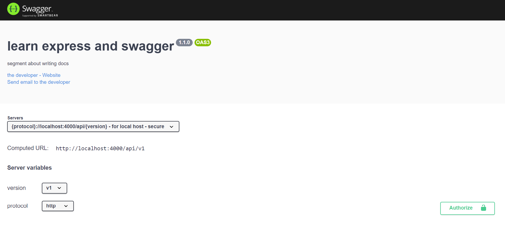
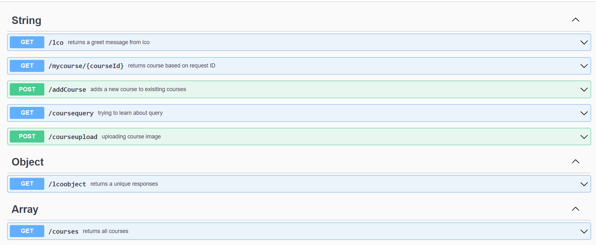
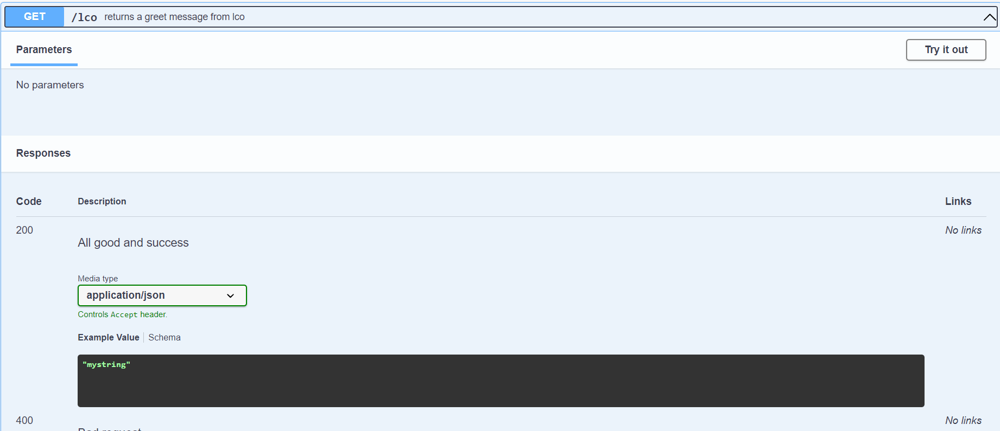
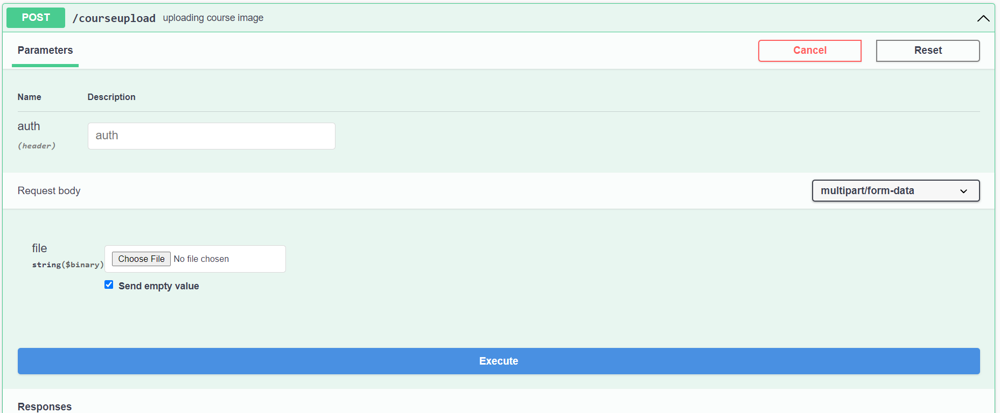

# Swagger Introduction
A project that helps to know about 'Swagger' API doc maker.

### What is Swagger ?

Simplify ***API development*** for users, teams, and enterprises with the Swagger open source and professional toolset.

Swagger takes the manual work out of API documentation, with a range of solutions for generating, visualizing, and maintaining API docs.

[Swagger Official Website](https://swagger.io/)

[Swagger Basic Structure](https://swagger.io/docs/specification/basic-structure/)

### To Run the application :
We are using ***OPENAPI 3.0.0*** in this project structure and ***YAML*** typing style. You should have installed ***nodeJS*** and ***npm*** in your machine.

 - Clone the project
	 `git clone https://github.com/singhanuj620/probackend_swagger`
	 
 - Install NPM dependencies 
 `npm install`
 
 - Run the server 
`npm run start`

 - Open web browser and go to 
`http://localhost:4000/api-docs`

### Thank You 🤗 💥🤩

#### ScreenShots -:

